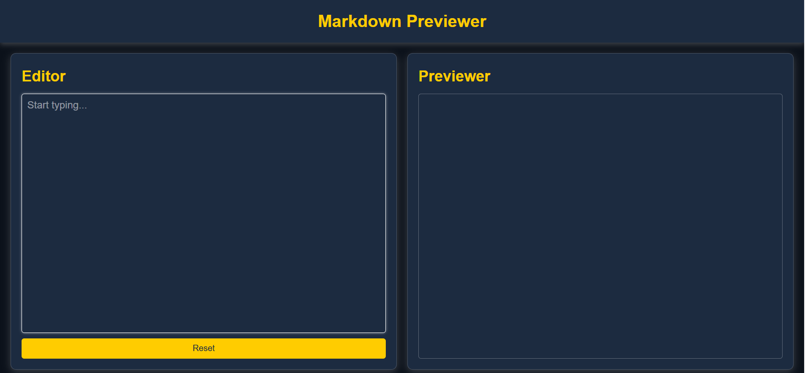

# Markdown Previewer

🚀 **Project Overview**  
This is a real-time Markdown Previewer that allows users to write Markdown and see the rendered HTML instantly. The preview updates dynamically as the user types.

## Features

- **Live Preview:** Instant Markdown to HTML conversion.
- **Syntax Highlighting:** Supports code blocks.
- **Reset Button:** Clears the editor and removes saved content.

## Screenshots

## Deployment Link

Markdown Previewer here: [**Live Demo**](https://markdown-previewer-nine-psi.vercel.app/)

## Technologies Used

- HTML
- CSS
- JavaScript
- Marked.js

## Usage

1. Type Markdown in the editor.
2. See real-time preview in the preview panel.
3. Click **Reset** to clear everything.
4. Content is auto-saved and restored on reload.
